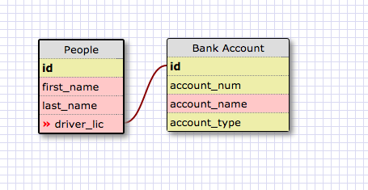
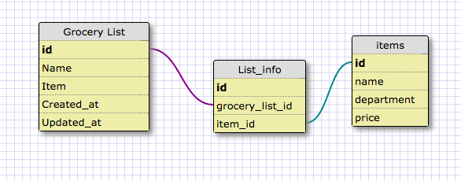

#8.5 More Schemas

## Release 2: Create a One-to-one Schema

### Consider a situation in which you would use a one-to-one relationship. Then, create your own one-to-one schema using Schema Designer. Each table should have at least four fields (which can include created_at and updated_at).

####Explain why this relationship is a one-to-one to the best of your ability.

This is a one-to-one relationship because each driver license can only be related to one type of bank account number.

## Release 4: Refactor

### Consider a grocery list. If you think about it, a grocery list has many items. Items can belong to many different grocery lists. Model the relationship between grocery_lists and items using Schema Designer. Each table should have at least four fields in each. You should also model the join table.

## Release 6: Reflect

#### What is a one-to-one database?

A one-to-one database is when the relationship between two tables is unique at the row level. In other words, any row in the first table can only be related to one row in the second table and vice-versa.

#### When would you use a one-to-one database? (Think generally, not in terms of the example you created).

The best places to use a one-to-one database would be when there is one unique id for the database. For example, people only have one social security number.

#### What is a many-to-many database?

A many-to-many database is when the relationship between two tables overlaps at the row level. In other words, many rows in the first table can be related to many rows in the second table and vice-versa.

#### When would you use a many-to-many database? (Think generally, not in terms of the example you created).

A many-to-many database is more common than one-to-one. This would be used mosty commonly in online web stores and customer data bases. There can be multiple things that will point to one id. For example, if you have one customer order multiple items from a list on an online store.

#### What is confusing about database schemas? What makes sense?

I think its hard to come up with schemas on your own. Well they make sense to me but with practive im sure they become easier to make.